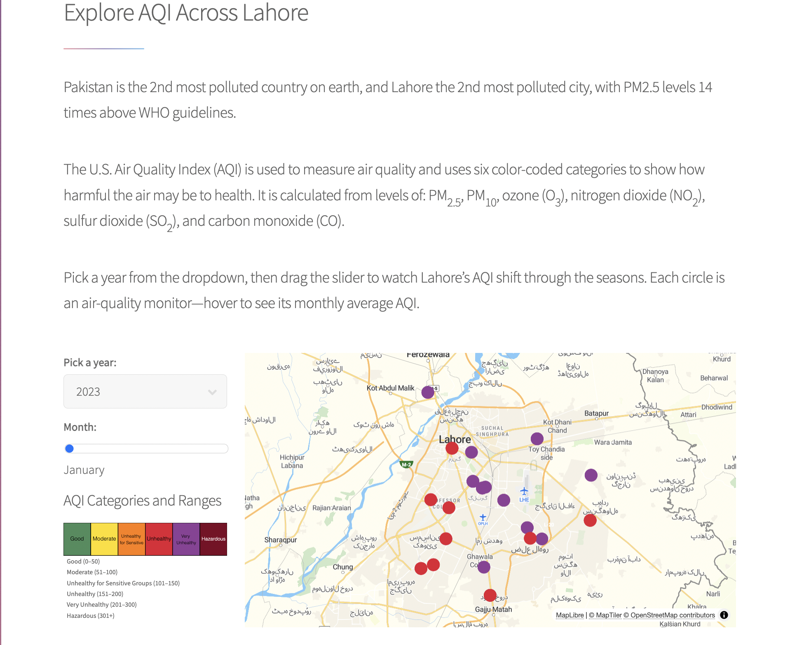

# Mapping Air Quality and Emission Flows in Lahore
## Sarah Hussain

## Description
According to the 6th Annual World Air Quality Report, Pakistan was ranked as the second most polluted country in the world, with PM2.5 concentrations approximately 14 times higher than the World Health Organization (WHO) guideline levels (IQAir, 2024). More specifically, Lahore is the second most polluted city in the world (IQAir). Through this project I explore how the air quality index (AQI) has changed over time in Lahore and how it changes across different seasons (months). I will also explore the breakdown of emissions by pollutants by each sector (power, domestic, transport etc) which can inform policymakers on how costs of pollution can be distributed across the economy. 

## Repository Structure Overview

#### `/src/preprocess.py`
This script cleans the AQI data and generates the GeoJSON file used by the map.

#### `/www`
This folder follows the structure of an [HTML5 UP](https://html5up.net/) template and contains the website’s static files (HTML, CSS, and assets).

#### `/www/data`
This folder constains the geojson that feeds the interactive map.

#### `/www/js`
This folder contains the JavaScript code for the interactive map and the Sankey graph.

## Data Sources
Omar, A., & Pakistan Air Quality Initiative (Pakistan). (2025). Unveiling Pakistan's Air Pollution: A National Landscape Report on Health Risks, Sources and Solutions. Pakistan Air Quality Initiative. https://doi.org/10.5281/zenodo.17629179