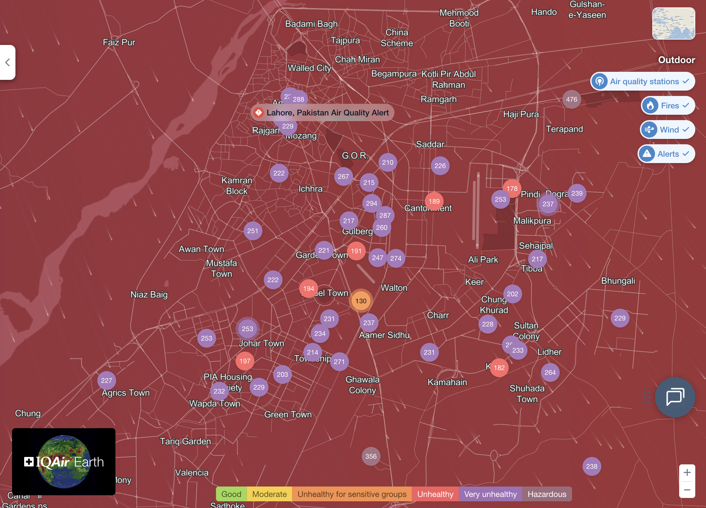

# Sarah Hussain 

## Description
According to the 6th Annual World Air Quality Report, Pakistan was ranked as the second most polluted country in the world, with PM2.5 concentrations approximately 14 times higher than the World Health Organization (WHO) guideline levels (IQAir, 2024). More specifically, Lahore is the second most polluted city in the world (IQAir). Through this project I want to explore how the air quality index (AQI) has changed over time in Lahore and how it changes across different seasons (months). I will also explore the breakdown of emissions by pollutants by each sector (power, domestic, transport etc) which can inform policymakers on how costs of pollution can be distributed across the economy. 

## Technical Plan re: Option B

I envision my project to mirror Option B (Dynamic Ensemble) with a map of Lahore similar to what [IQAir](https://www.iqair.com/us/air-quality-map/pakistan/punjab/lahore) compiles for daily AQI measurements, with a slider or a play button similar to [this](https://www.270towin.com/2024-simulation/) allowing users to see how AQI measurements vary across months and across the city as a whole, with an additional option to choose the year.
To explore and compare sectoral emissions, I plan on having a dropdown menu to allow users to choose two sectors and use bar graphs to compare each sector’s contribution to total emissions by each pollutant type.
While Altair can be used for the bar graphs for the sectoral emissions, I am open to exploring other options. For the interactive map, I was considering MapLibre GL JS.

## Mockup
For the map, I plan to replicate this pattern: each circle is an air-quality monitor, with its color showing how healthy or unhealthy the AQI was at that moment.

## Data Sources

I will use data collected by the Pakistan Air Quality Initiative (PAQI). For Lahore, they report daily average US AQI readings from ~50 monitors across the city.

### Data Source 1: Daily AQI Data

Size: 43,303 rows, 7 columns

This dataset provides daily average US AQI and PM2.5 readings for each monitoring location, along with the latitude/longitude of each monitor. I will rely on US AQI to assign health categories (Good/Moderate/Unhealthy) rather than raw PM2.5.

### Data Source 2: Emissions Inventory
Size: 242 rows, 6 columns

This dataset reports 2021 emissions estimates (in kilotonnes) by sector and subsector, with pollutant-specific contributions. My primary focus will be on PM2.5, SO₂, NOₓ, and CO.

## Questions
1. Which package is best for rendering a map of Lahore?
2. Should I obtain shapefiles/GeoJSON so I can layer the air-quality monitor coordinates over the map?
3. Will MapLibre GL JS let me add and style point layers (monitors)?
